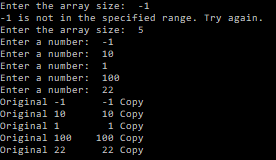

# Assignment 1 – Array Replicator

## Value (%)
This assignment is worth 10% of your course grade.

## Task 1
Many programs involve taking input from a user and converting it to a number. Let's write some methods to do this common task.

## Task 2
Write a method that replicates (deep copies) the contents of one int array into another array.

## How to Complete This Assessment

### Task 1 – Pick a Number
1. The method signature `int AskForNumber(string text)` is provided. Complete this method by doing the following.
2. Display the `text` parameter on the command line.
3. Retrieve a response from the user, convert it into an `int` and return it.
4. The method signature `int AskForNumberInRange(string text, int min, int max)` is provided. Complete this method by doing the following.
5. Give this method the same functionality as the `AskForNumber` method but only return a value if the number is in the interval `[min, max]`.

### Task 2 – Array Replicator
1. Get an integer from the user that is in the range `[0,5]`.
2. Ask the user for the appropriate number of integers and put them in an array.
3. The method signature `int[] ReplicateArray(int[] original)` is provided. Complete this method by doing the following.
4. Make a second array that is the same size as the incoming array,
5. Use a loop to copy the values of the original array into the new array.
6. Return the copied array.

## How to Submit Your Assessment
Submit a link to the GitHub repo containing your code and embed an image into the README showing the results of running your code. An example image is below.

# Grading Rubric

## Results (70%)

| Points | Description                                                                                   |
|:------:|-----------------------------------------------------------------------------------------------|
|   7    | Excellent: Thorough test coverage including edge cases; all tests pass.                      |
|   6    | Good: Comprehensive test coverage with some edge cases; majority of tests pass.              |
|   5    | Satisfactory: Adequate test coverage; more than half of tests pass.                          |
|   3    | Needs Improvement: Limited test coverage; less than half of tests pass.                      |
|   1    | Poor: No tests or minimal tests; none of the tests pass.                                     |
|   0    | Code does not build in the CI workflow.                                                       |

## Class/Method/Variable Naming (10%)

| Points | Description                                                                                   |
|:------:|-----------------------------------------------------------------------------------------------|
|   1    | Excellent: Consistent, meaningful, and clear naming conventions for all classes, methods, and variables. |
|  0.75  | Good: Mostly consistent and meaningful naming conventions; minor inconsistencies or unclear names. |
|  0.5   | Needs Improvement: Inconsistent naming conventions; some unclear or confusing names.          |
|   0    | Poor: No clear naming conventions; many unclear or confusing names.                           |

## Comments/Documentation (10%)

| Points | Description                                                                                   |
|:------:|-----------------------------------------------------------------------------------------------|
|   1    | Excellent: Comprehensive comments and documentation; easy to understand the purpose and functionality of code. |
|  0.5   | Needs Improvement: Some comments and documentation, but lacking clarity or detail in certain areas. |
|   0    | Poor: No comments or documentation; difficult to understand the purpose and functionality of the code. |

## Formatting (10%)

| Points | Description                                                                                   |
|:------:|-----------------------------------------------------------------------------------------------|
|   1    | No formatting is required during the formatting workflow.                                     |
|  0.25  | Minimal formatting is required during the formatting workflow.                                |
|   0    | Extensive formatting is required during the formatting workflow.                              |

